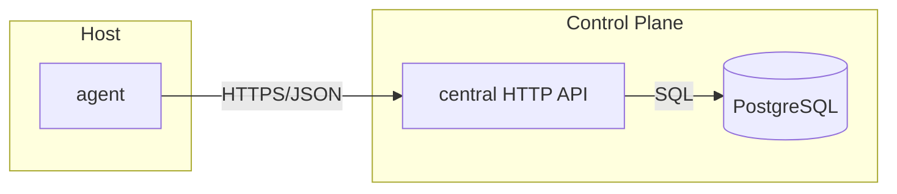
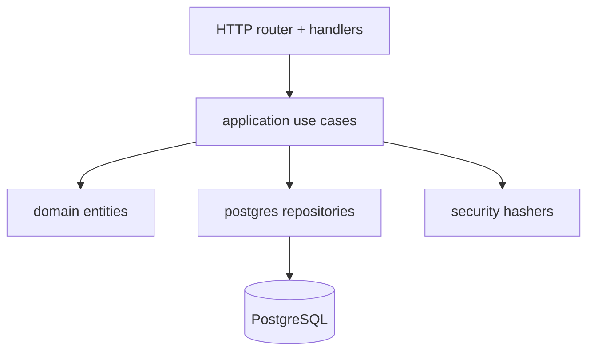
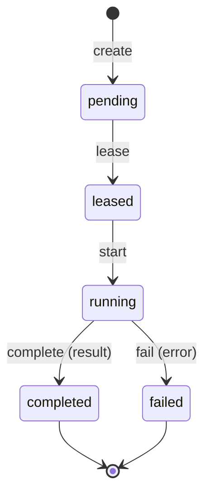
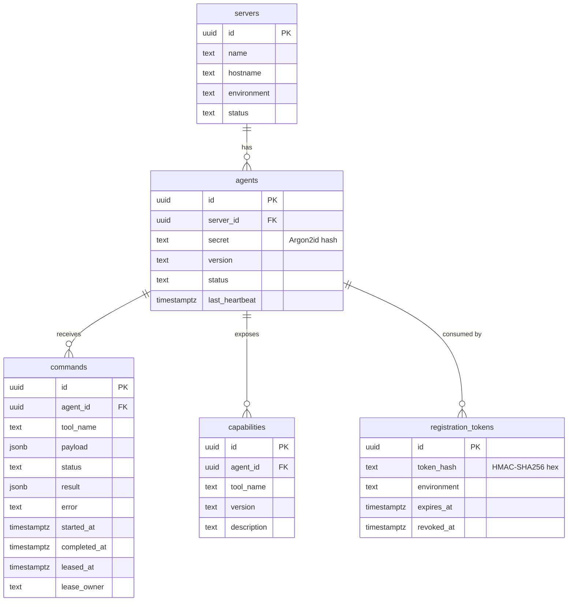
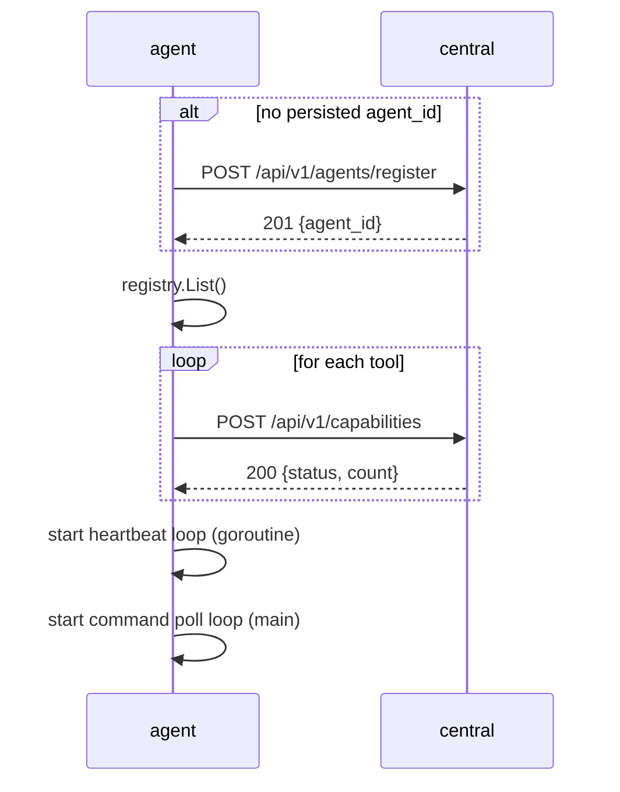
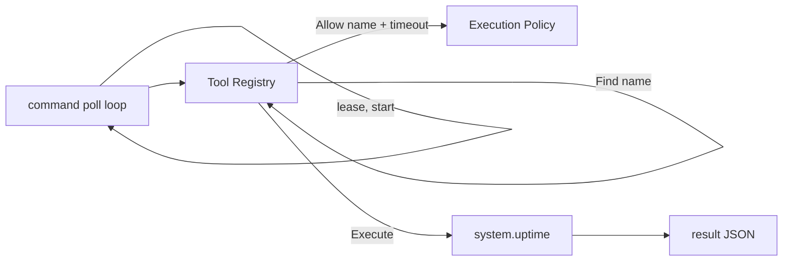

# opspilot — Architecture

This document describes the **current** implementation only. Planned features are intentionally not covered.

## Overview

opspilot is a Go monorepo with two executables:

- **central** — the control plane. Exposes a JSON HTTP API, owns the PostgreSQL database, and holds the command queue.
- **agent** — runs on managed hosts. Registers itself, reports heartbeats, advertises its capabilities, and polls for, executes, and reports commands.



## Module layout

```
cmd/
  central/            central binary entrypoint
  agent/              agent binary entrypoint
internal/
  bootstrap/          central composition root, lifecycle, graceful shutdown
  transport/http/     HTTP handlers, DTOs, routing (central)
  application/        use cases (agent, command, capability)
  domain/             entities (agent, server, command, registrationtoken)
  infrastructure/
    postgres/         sqlc-backed repositories, pgx pool
    security/         HMAC (tokens) and Argon2id (secrets) hashers
  agent/              agent runtime, tool registry, executor, policy
pkg/
  config/             env-based configuration
  logger/             zap logger
gen/postgresql/       sqlc-generated query code (checked in)
sql/
  migrations/         0001..0011 schema migrations
  queries/            annotated SQL consumed by sqlc
```

## Central

### Layering

Central follows a clean/hexagonal style. Dependencies point inward: `transport → application → domain`, with `infrastructure` implementing the interfaces the application layer declares.



### Composition root

`internal/bootstrap` wires everything: loads config → builds logger → opens the pgx pool (`MaxConns=10`, `MinConns=2`) → constructs repositories, hashers, and use cases → starts the HTTP server and shuts down gracefully on SIGINT/SIGTERM.

### HTTP API

| Method | Path                    | Auth        | Success response |
| ------ | ----------------------- | ----------- | ---------------- |
| GET    | `/healthz`              | —           | `200 ok`         |
| POST   | `/api/v1/agents/register` | token      | `201 {agent_id, status}` |
| POST   | `/api/v1/agents/heartbeat` | agent_id+secret | `200 {status, next_heartbeat}` |
| POST   | `/api/v1/commands`      | —           | `201 {command_id, status}` |
| POST   | `/api/v1/commands/lease` | —          | `200 {command_id, tool, payload}` or `204` |
| POST   | `/api/v1/commands/start` | —          | `200 {command_id, status}` |
| POST   | `/api/v1/commands/complete` | —        | `200 {command_id, status}` |
| POST   | `/api/v1/commands/fail` | —           | `200 {command_id, status}` |
| POST   | `/api/v1/capabilities`  | agent_id+secret | `200 {status, count}` |

Errors use a consistent envelope: `{"error":{"code","message"}}`. Command transition endpoints enforce ownership and state: `404 not_found`, `403 command_not_owned`, `409 invalid_transition`.

### Command lifecycle

Commands flow through a state machine persisted in PostgreSQL. Transitions are atomic `UPDATE ... WHERE status = 'expected'` statements; leasing uses `FOR UPDATE SKIP LOCKED` (FIFO by `created_at`) so concurrent agents never claim the same row.



### Database schema



### Security

- **Registration tokens**: a one-time token is stored as `HMAC-SHA256(OPSPILOT_AUTH_SERVER_SECRET, token)` (hex). Registration consumes it atomically; replay returns `409 token_already_used`.
- **Agent secrets**: plaintext secrets are never stored. Registration persists an Argon2id hash; heartbeat and capability sync verify against it.

## Agent

### Startup



### Tool execution

The agent never switches on tool names. Execution is `Registry → Find → Execute`:



The registry currently contains one tool:

- **`system.uptime`** — runs `/usr/bin/uptime` and returns `{"stdout","stderr","exit_code"}`.

The execution policy gates every tool by name (`enabled` / `allowed_commands` / `denied_commands`) and bounds execution with `timeout`. Any unregistered tool name returns `tool not implemented`.

### Command loop

The agent polls on a configurable interval. Each iteration: lease one command → `start` it → execute the tool → `complete` with the result or `fail` with the error. An empty queue (`204`) just sleeps until the next tick.

## Configuration

| Binary   | Source                      | Keys (examples) |
| -------- | --------------------------- | --------------- |
| central  | env (`OPSPILOT_*`)          | `OPSPILOT_HTTP_PORT`, `OPSPILOT_DB_HOST`, `OPSPILOT_AUTH_SERVER_SECRET` |
| agent    | YAML (`configs/agent.example.yaml`) | `central_url`, `registration_token`, `secret`, `poll_interval`, `execution_policy` |

## Development tooling

- **sqlc v1.31.1** generates `gen/postgresql` from `sql/queries` + `sql/migrations` (`make sqlc-generate`).
- **Makefile** targets: `build`, `test`, `vet`, `run-central`, `run-agent`, `dev-up` (PostgreSQL via `deployments/docker-compose.yml`).
- **Logging**: zap — console encoding in development, JSON in production.
